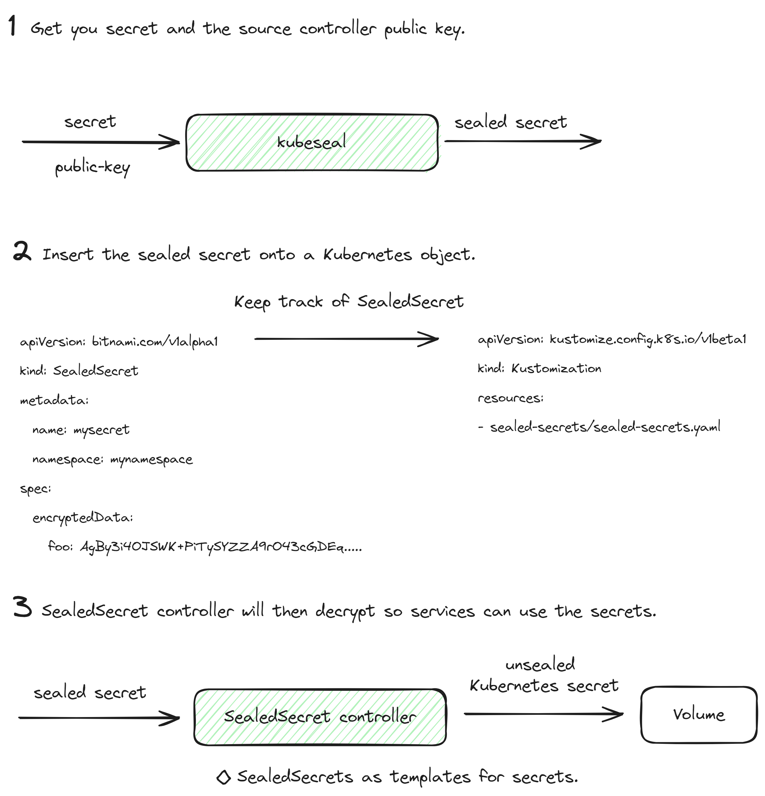

# Kubernetes Concepts


A high level overview of Kubernetes specific concepts.

## High-Level Architecture

Control plane node exposes the Kubernetes API through the API server and manages
the nodes that make up the cluster, that is responding to cluster events. Worker
node on the other hands execute workloads in container managed by Pods. 


Kubernetes objects stand as a blueprint to deploy a number of different 
instances. For example, a pod in Kubernetes is the least deployable unit in 
and there can be many instances of it with their own identity. We can think of
Kubernetes primitive objects as a class in object-oriented programming which
define the blueprint of a functionality.

## Using kubectl

The kubectl is the way we interact with Kubernetes through the command line 
tool. While interacting with Kubernetes we can either take a declarative or an 
imperative approach. The declarative approach uses YAML manifest files to manage
Kubernetes objects. One of the key advantages of using this kind of approach is 
because it focused on reproducibility and improved maintenance. Usually the
manifest are checked onto a version control system and offer a way to keep track
of the changes. This kind of approach is the one recommended for production environments.

Kubectl has a predefined format to all of its commands. 


## Containers

As we know, Kubernetes is a container orchestrator that uses a container runtime
to instantiate container inside of pods, the least deployable unit. A container
will package an application into a single unit of software including its 
runtime environment and configuration. Its goal is to decouple the runtime 
environment from the application to avoid environment specific type of errors.

The container runtime engine such as Docker is the software component that can 
run containers on a host operating system. A container orchistrator uses a 
container runtime engine to instantiate a container while adding features on top
of it.

So a developer will define the ContainerFile for its application and how its 
supposed to be packaged. Then this container file can be build and turned into
an image which can be published on a registry for the stakeholders to use. 
Lastly a tool such as Kubernetes will use a runtime engine to instantiate those
containers adding additional features on top of them. 


To summarize, the Dockerfile is a blueprint of how the software should be built, the image is the artifact produced by the process, and the container is an running instance of the image serving the application

## ConfigMap Generator

Usually deployments make use of ConfigMap variables to launch the necessary 
containers, but sometimes a ConfigMap needs to be changed to account for new
variables or even simple more mundane changes. The problem arises when everything
is already up and running so the deployment wont acknowledge the new ConfigMap and
you need to manually kill the deployment and launch it again. 

This can be handled with the [configMapGenerator](https://github.com/openshift/kubernetes-kubectl/blob/master/docs/book/pages/reference/kustomize.md#configmapgenerator) option from kustomize. Every time 
the configuration files change, kustomize will create a new version of the configMap. 
Usually this new version has a hash as an appendix attached to it as a sort of 
version. Since its a new version, the deployment which consumes the new ConfigMap will 
then acknowledge the change and update accordingly. 


```

apiVersion: kustomize.config.k8s.io/v1beta1
kind: Kustomization
configMapGenerator:
# generate a ConfigMap named my-java-server-props-<some-hash> where each file
# in the list appears as a data entry (keyed by base filename).
- name: my-java-server-props
  files:
  - application.properties
  - more.properties
# generate a ConfigMap named my-java-server-env-vars-<some-hash> where each literal
# in the list appears as a data entry (keyed by literal key).
- name: my-java-server-env-vars
  literals:	
  - JAVA_HOME=/opt/java/jdk
  - JAVA_TOOL_OPTIONS=-agentlib:hprof
# generate a ConfigMap named my-system-env-<some-hash> where each key/value pair in the
# env.txt appears as a data entry (separated by \n).
- name: my-system-env
  env: env.txt

```

## Sealed Secret

[Sealed Secret](https://github.com/bitnami-labs/sealed-secrets/tree/main) is a third party tool to encrypt Secrets in Kubernetes so they are
safe to store. There is no native Kubernetes tools to safely store secrets, there 
is only the Secret object but that allows its management nothing else. There are two 
main features that allow for this type of workflow first a SealedSecret controller 
present on the target cluster and a ``kubeseal`` tool to encrypt the secrets so only 
the controller and nobody else is able to decrypt them. And only a certain controller
will be able to decrypt them because secrets are encrypted with your controller public
key.

Lets say you have a Private GKE cluster. In this case we use an offline sealing method
for our secrets. For example, we have a DB Password that we would like sealed. You
would seal the secret as such:

``kubeseal --cert=cert.pem<secret.yaml``

Once the sealedsecret configuration has been created we can create a SealedSecret
kubernetes object that will allow us to manage the sealedsecret. This can be safely
stored in a even public repositories and no one will be able to decrypt it only our 
specific source controller.

```

apiVersion: bitnami.com/v1alpha1
kind: SealedSecret
metadata:
  name: lock
  namespace: lock
spec:
  encryptedData:
  # Secret encrypted by Kubeseal
    LOCK_DB_PASSWORD: AgAaRL...
  template:
    metadata:
      name: lock
      namespace: lock
    type: Opaque

```

In order to install the sealedsecret controller onto our cluster there are several
ways. We can either install the controller through kustomize or through helm charts
whatever we find more comfortable.



## Template Renderer

Services use ConfigMaps (for non-sensitive data) and Secrets (for sensitive data) to 
store configuration data in the form of environment variables and are two separate 
files that are passed to the container on deployment. Template Renderer allows to have 
a single configuration file and facilitates full visibility of the service 
configuration file.

In reality, template renderer is quite simple. Service need configuration files, these
configuration files will be created at init time by rendering templates defined on 
configMaps. Its goal will be variable substitution, which normally involves 
sensitive data such as secrets or variables to indicate a different cluster for 
example. If there is no variable to substitute you dont need template renderer.


You create a configMap that will hold two separate files, then you mount a volume onto
the deployment that contains said configMap and the files on the data field. Template
renderer will extract the necessary files from the configMap and create configuration
files from them. These configuration files will be used to serve the services that
containers are handling.

Remember how files are added to the data field of a configMap.

```

kind: ConfigMap
metadata:
  name: game-demo
data:
  # property-like keys; each key maps to a simple value
  player_initial_lives: "3"
  ui_properties_file_name: "user-interface.properties"

  # file-like keys
  game.properties: |
    enemy.types=aliens,monsters
    player.maximum-lives=5    
  user-interface.properties: |
    color.good=purple
    color.bad=yellow
    allow.textmode=true
   
```
